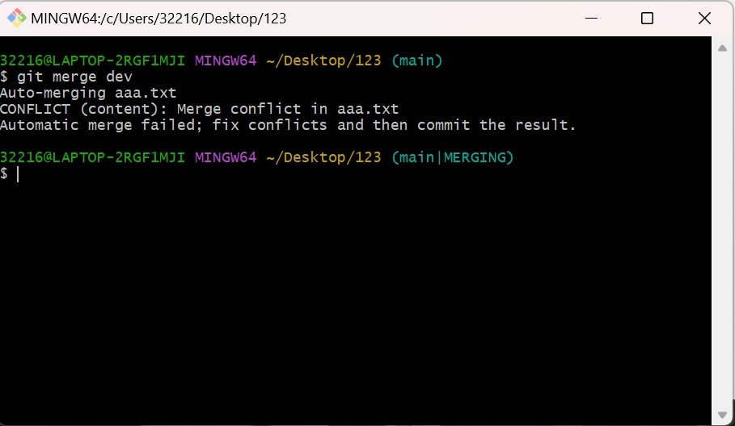
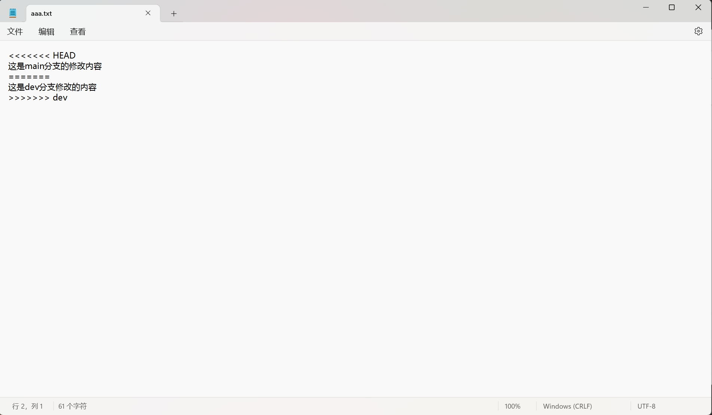
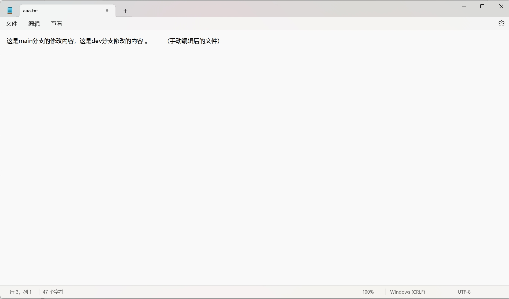
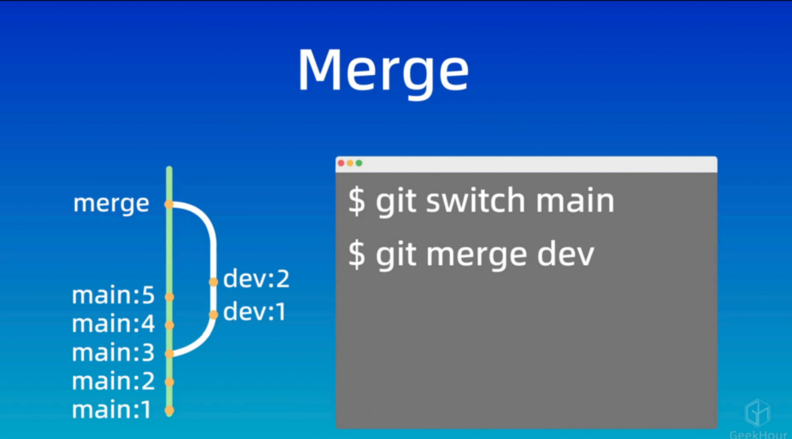
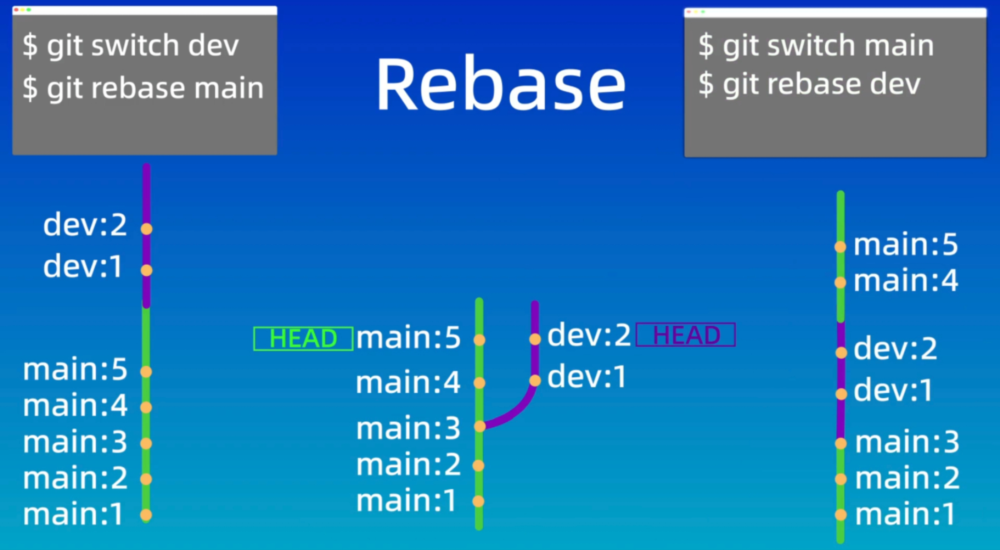

=[TOC]

# git 教程


## 一.  初始化配置

`git config --global user.name "咖啡赋能"`					<!--配置用户名-->

`git config --global user.email 3221687270@qq.com`		    <!--配置邮箱-->

`git config --global credential.helper store`			      <!--保存用户名和账号-->

`git config --global --list`								 <!--查看用户名和邮箱-->

---


## 二.  新建仓库

### 1. 在本地创建一个仓库

`git init`													<!--创建一个仓库-->

`git init 仓库名称`											<!--指定名称,会在当前目录创建一个新的目录作为仓库-->

**生成一个.git目录,存放了git仓库的所有数据**


### 2. 通过远程克隆一个仓库

`git clone 仓库地址`


## 三.  工作区域与文件状态

### **1. 工作区域**

|   **工作区**   |             暂存区             |               本地仓库                |
| :---------: | :-------------------------: | :-------------------------------: |
| *.git*所在的目录 | *.git/index*用于临时存放即将提交的修改内容 | *.git/objects*  git存储代码和版本信息的主要位置 |


**工作区 ** **-->>** `git add`  **-->>**   **暂存区 ** **-->>** `git commit`  **-->>**  **本地仓库**


### **2. 文件状态**

| 未跟踪 | 未修改 | 已修改 | 已暂存 |
| :-: | :-: | :-: | :-: |


## 四.  添加和提交文件


**下面来演示一下添加和提交文件**


### **1.  在test文件夹仓库初始化**

`git init`

### **2.  在文件夹内加入将要提交的文件**


### **3.  将文件加入到工作区**


此时仓库的状态如下			`git status`		<!--查看仓库当前状态-->


### **4.  提交文件到仓库**

`git commit -m "提交说明"`						


`git commit`				若无-m,则会自动进入一个交互界面,默认会使用vim来编辑提交信息


可以使用方向键移动光标

使用`i`键进入编辑模式,输入提交信息


按esc回到命令模式,输入`:wq`保存退出


至此提交完成


使用`git log`可以查看提交记录


## 五.  git reset回退版本

###      git reset的三种模式

|      git reset --soft      |      git reset --hard      |       git reset  --mixed        |
| :------------------------: | :------------------------: | :-----------------------------: |
| 回退到某一版本,并且保留工作区和暂存区的所有修改内容 | 回退到某一版本,并且丢弃工作区和暂存区的所有修改内容 | 回退到某一版本,并且保留工作区的修改内容,丢弃暂存区的修改内容 |

mixed 是`git reset`的默认参数

`git reset HEAD^`			回退到上一个提交版本


`git reflog`     可查看所有操作的版本号,使用`git reset --hard 版本号`即可回溯到操作之前的版本

`git ls-files`    可查看暂存区中的内容


## 六.  使用git diff查看差异

`git diff`默认为 "查看工作区,暂存区之间的差异"

### 1.查看工作区,暂存区,本地仓库之间的差异

`git diff HEAD`       比较工作区与版本库之间的差异

`git diff --cached`       比较暂存区与版本库之间的差异

### 2.查看不同版本之间的差异

`git diff 版本提交id1 版本提交id2`        比较两个版本之间的差异

`git diff HEAD 版本提交id`		      比较最新版本与id版本的差异

`git diff HEAD~ HEAD`      	  	      比较当前版本与上一个版本的差异

**`HEAD` 指向分支的最新提交节点		 `HEAD~2`表示HEAD之前的两个版本**

`git diff HEAD~ HEAD 文件名`                 比较该文件名在两个版本之间的差异

### 3.查看文件在两个分支之间的差异

 `git diff 分支名1 分支名2`


##  七.  删除文件

### 1. 删除本地文件后提交 

`rm 文件名`           linux操作系统的指令

windows操作系统直接删除即可

`git add 文件名`          或者       `git add .`

### 2. 使用git rm删除文件

- `git rm 文件名`	                                      把文件从工作区和暂存区同时删除

​       `git rm --cathed 文件名`	 		  把文件从暂存区删除，但保留在当前工作区中

​       `git rm -r *`						递归删除某个目录下的所有子目录和文件

- `git commit -m "提交说明"`


## 八.  gitgnore忽略文件

### 1. 应该忽略哪些文件

1. 系统或者软件自动生成的文件
2. 编译产生的中间文件和结果文件
3. 运行时生成的日志文件,缓存文件,临时文件等
4. 涉及身份,密码,口令,密钥等敏感信息文件

### 2. 使用说明

1. 在仓库中添加一个   .gitignore   文件
2. 在  .gitignore  文件里面加入将要忽略的文件名(*.log表示以log为结尾的一类文件)

### 3. 使用细节

.gitignore对版本库中已经存在的文件不生效

### 4. 文件匹配规则

1. 从上到下逐行匹配, 每一行表示一个忽略模式
2. 空行或者以#开头的行会被Git忽略. 一般空行用于可读性的分隔, #一般用作注释
3. 使用标准的Blob模式匹配, 例如:
   1. 星号*通配任意个字符
   2. 问号?匹配单个字符
   3. 中括号[]表示匹配列表中的单个字符, 比如:[abc]表示a/b/c 

4. 两个星号**表示匹配任意的中间目录

5. 中括号可以使用短中线连接, 比如:

     		[0-9]表示任意一位数字, [a-z]表示任意一位小写字母

6. 感叹号! 表示取反


## 九. SSH配置和克隆仓库

### 1. ssh密钥配置

1. 在终端输入`ssh-keygen -t rsa -b 4096`		<!--生成ssh密钥-->

​              会在用户根目录生成.ssh文件夹,  生成两个密钥, 一个私钥, 一个公钥 (.pub结尾)

2. 在github用户的sitting内找到SSH keys, 将生成的公钥复制进去

3. 创建config文件

   ​          输入下面代码

   ```
   # github
   Host github.com
   HostName github.com
   PreferredAuthentications publickey
   IdentityFile ~/.ssh/id_rsa
   ```

   或者

   ```
   Host github.com
   HostName ssh.github.com
   User git
   Port 443
   ```

   4. 在终端输入`git clone repo-address`  即可克隆远程仓库到本地

      repo-address查找如下

      

### 2. 克隆仓库

`git push <remote> <branch>`           推送更新内容

`git pull <remote>` 			     拉取更新内容


## 十. 关联本地仓库和远程仓库

###        1. 关联本地仓库

1. `git remote add <shortname> <url>`		//添加远程仓库

   ​                                   shortname为仓库别名, 一般默认为 origin

   使用`git remote -v`    可以查看其对应的远程仓库的地址

2. `git branch -M main`                                           // 指定分支的名称为main

3. `git push -u origin main`                                 //将本地的main分支与远程的main分支关联起来

   或者`git push --upstream origin main:main`      //将本地仓库的main分支推送给远程仓库的main分支

至此本地仓库与远程仓库关联成功


### 2. 从远程仓库获取内容

1. 使用`git pull <远程仓库名><远程分支名>:<本地分支名>`          

   仓库名称和分支名称可以省略,默认为拉取仓库别名为origin的main分支， 远程分支名与本地分支名相同时可以省略:后面部分

   `git pull`命令会自动执行一次合并操作（可能会有冲突， 需要手动处理冲突）

2. 使用`git fetch`命令只会获取远程仓库的修改， 并不会自动合并


##   十一. 分支(git重点)

### 								指令介绍

1. `git branch`                    //查看当前仓库的所有分支

2. `git branch 分支名`       //创建一个新的分支

3.  `git branch -d 分支名`  //删除已经完成合并的分支

4.  `git banch -D 分支名`     // 强制删除分支

5. `git checkout 分支名`   

   `git switch 分支名`        //两者都能切换分支

​                     注意         `git checkout`命令还可以用来回复文件或者目录到之前的某个状态

​	                               为了避免歧义,Git官方在2.23版本提供新的命令` git switch `专门用来切换分支 

4. `git merge 分支名`           //合并分支
5. `git merge --abort`      //终止合并
6. `git log --graph --oneline --decorate --all`        //查看分支图


###                                                        解决分支合并冲突


如下图

此时文件夹内已有aaa.txt(已经提交到main分支中)


```
git branch dev               //创建dev分支
git switch dev               //切换到dev分支中
```

 将aaa.txt文档的内容修改如下


```
git commit -am "提交说明"			//将dev分支修改的内容提交
git switch main                    //切换到main分支
```

  将aaa.txt文档的内容修改如下


```
git commit -am "提交说明"			//将main分支修改的内容提交
git merge dev                      //合并分支
```

此时提示合并冲突



同时文件内容也发生改变



此时需要手动处理冲突, 手工编辑文件内容



此时再将文件提交

```
git add .
git commit -m "提交说明"
```

至此, 分支合并完成


**注意:**

 此时的分支依然存在,  可以使用`git branch -d 分支名` 命令来删除分支


## 十二. rebase

### 1. 合并分支的另一种方式

`git rebase 分支名`		

#### merge 合并分支

此时main分支上会在合并时多一次提交记录(在main分支上合并)			



#####  优点:

​		不会破坏原分支的提交历史, 方便回溯和查看

##### 缺点:

​		会产生额外的提交节点, 分支图比较复杂


#### rebase 合并分支

##### 1. 在dev分支上合并分支

此时dev分支的提交记录会被接到main分支最新提交的后面


##### 2.在main分支上合并分支

此时dev分支的提交会被接在分支处, main分支上从分支点到最新提交点的所有提交会被接在dev 分支提交后面

**如下图所示**




##### 优点:

​	不会新增额外的提交记录, 形成线性历史, 比较直观和干净;

##### 缺点:

​	会改变提交历史, 改变了当前分支branch out的节点

​	避免在共享分支使用


注:图片素材来自[b站up:GeekHour](https://b23.tv/AfxCPuU)


